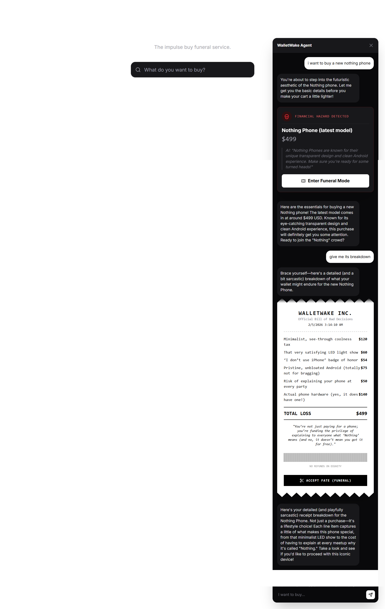

# ⚰️ WalletWake — The Impulse Buy Funeral Service

**"The UI Strikes Back" Hackathon Submission**

<p align="center">
  
</p>

---

## What

WalletWake is a **fully chat-driven** impulse buy intervention app powered by Tambo's Generative UI. Tell the AI what you want to buy, and it shows you a **funeral** for that purchase: the price in ramen packs, coffees, hours of work, plus a spoken eulogy and a gloomy picture. Then a **48-hour wait**. After that you can buy with a clear head or walk away.

---

## Why

Impulse buys feel good for five minutes. This adds friction so you see the real cost and hear it roasted out loud. If you still want it after 48 hours, fine — that's a choice, not a reflex.

---

## How

**Using it**

- **Chat:** Click **Start Chatting** and tell the AI what you want to buy (e.g., *"I want a PS5"* or *"Break down the cost of an iPhone"*). The AI responds with:
  - **Funeral Ticket** — for general purchase intent
  - **Roast Receipt** — for detailed cost breakdowns
  - **Spending Insight** — shows price in real-world equivalents
  - **Impulse Score** — rates your purchase from 1-10
  - **Alternative Suggestions** — cheaper/better options
- **Enter Funeral Mode:** Click **Enter Funeral Mode** on any ticket/receipt. You get a full-screen funeral: guilt math (price as ramen, coffee, etc.), a 48-hour countdown, a custom gloomy image, cheaper alternatives carousel (GSAP-animated), and a spoken eulogy. Turn sound on.
- **After 48 hours:** A "Clarity" screen lets you buy or close. Or use **Skip 48h** in dev to test.

**Running it**

1. Clone the repo, then:
   ```bash
   cd walletwake
   npm install
   ```
2. Add a `.env.local` in the project root:
   ```env
   NEXT_PUBLIC_TAMBO_API_KEY=your_tambo_key
   GEMINI_API_KEY=your_google_ai_studio_key
   ELEVENLABS_API_KEY=your_elevenlabs_key
   ELEVENLABS_VOICE_ID=pNInz6obpgDQGcFmaJgB
   ```
3. Start the app:
   ```bash
   npm run dev
   ```
4. Open [http://localhost:3000](http://localhost:3000). Click **Start Chatting** and ask about any product. The AI will generate appropriate components based on your query.

---

## What's inside (plain terms)

- **Fully chat-driven:** Every interaction goes through Tambo's Generative UI. No search bars — just natural language.
- **5 Tambo Generative Components:**
  - `funeral-ticket` — Warning ticket for purchase intent
  - `roast-receipt` — Sarcastic receipt breakdown
  - `spending-insight` — Real-world price perspective
  - `impulse-score` — Visual danger gauge (1-10)
  - `alternative-suggestion` — Better options list
- **2 Tambo Local Tools:**
  - `calculate_real_cost` — Converts prices to ramen/coffee/work equivalents
  - `search_products` — Searches product catalog
- **Context Helpers:** Agent knows its role, personality, and available actions
- **Funeral view:** Custom gloomy image, price conversions, 48-hour timer, GSAP-animated alternatives carousel, spoken eulogy
- **Tech:** Next.js 16, Tambo (Generative UI), Google Gemini (text + images), ElevenLabs (voice), GSAP (animations), Tailwind CSS 4

---

## Design

**Jony Ive × Dalmasca/Altana aesthetic:**
- Warm, ethereal color palette (parchment whites, sandy golds, terracotta accents)
- Radical reduction — minimal, purposeful UI
- Generous whitespace and precise typography
- Subtle materiality with glass surfaces
- Purposeful motion with GSAP animations

---

## Hackathon tracks

- **Best Use of Generative UI** — 5 generative components, 2 local tools, context helpers
- **Most Creative AI Agent** — Witty, sarcastic personality that discourages impulse buys

---

## Features

- ✅ Fully chat-driven (no search flow — everything through Tambo)
- ✅ 5 Tambo generative components with intelligent component selection
- ✅ 2 Tambo local tools for price calculations and product search
- ✅ Context-aware agent with personality and clear instructions
- ✅ GSAP-animated alternatives carousel with stagger effects and marquee scroll
- ✅ Markdown rendering in chat (bold, italic, line breaks)
- ✅ Elegant funeral flow with 48-hour intervention period
- ✅ Custom AI-generated gloomy product images
- ✅ Spoken eulogies via ElevenLabs TTS
